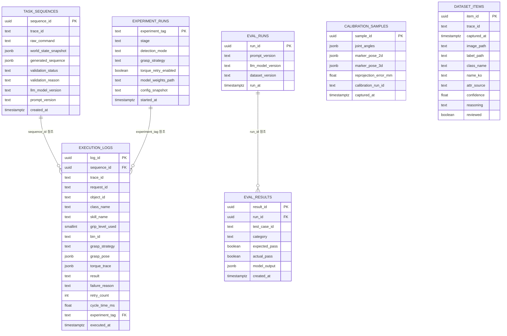

# 시스템 명세서: 자연어 지시 기반 협동로봇 다품종 분류·피스피킹 시스템

BR 문서(v2)와 인터페이스 정의서(`인터페이스_정의서.md`)의 요구사항을 구현 가능한 수준으로 구체화한 기술 명세서다. 저장소 `~/cobot2_ws/src/piece_picking_system`의 실제 패키지 구성을 기준으로 작성했다.

---

## 0. 개발 범위와 단계 로드맵

BR v2는 개발 범위를 **1차 / 2차 / 확장**으로 나누고, 0~10단계로 세분화했다. 본 명세서의 2~6절은 **1차+2차 범위**를 우선 구현 대상으로 하며, 7~10단계(확장)는 NFR-06(서비스 독립 교체)·NFR-08(스킬 스키마 확장성) 원칙에 따라 기존 구조를 바꾸지 않고 얹는 것을 전제로 한다.

| 단계 | 범위 | 목표 | 관련 서비스/컴포넌트 |
|---|---|---|---|
| 0 | 1차 | 캘리브레이션 | `calibration/` (오프라인 스크립트, 컨테이너화 이전) |
| 1 | 1차 | 검출 확인 | perception |
| 2 | 1차 | 세그멘테이션 | perception |
| 3 | 1차 | 파지 방법 비교 (3전략) | grasp |
| 4 | 1차 | LLM 지시 기반 분류 (**1차 목표 달성 지점**) | planner, web, db |
| 5 | 2차 | 신규 품목 확인 루프 + 사용자 승인 | planner(`vlm_client.py`), web, db |
| 6 | 2차 | 음성 인터페이스(STT) | web(`stt.py`) |
| 7 | 확장 | 기울어진 물체 | perception, grasp (6D pose 추정 필요) |
| 8 | 확장 | 투명 물체 파지 | perception(뎁스 보완), control(능동 재촬영) |
| 9 | 확장 | 하차/탐색 + 싱귤레이션 | planner(탐색 상태기계), control(신규 스킬) |
| 10 | 확장 | 컨베이어 동적 픽업 | perception(트래킹), control(실시간 재계획) |

---

## 1. 전체 구성 개요

```
[웹 UI] --- [로봇 제어박스] --- [M0609 + SG2 + 손목 카메라]
    |
[GPU 워크스테이션]
    ├─ perception  (검출/세그멘테이션, instance_masks 발행)
    ├─ grasp       (파지 자세 추정, 3전략)
    ├─ planner     (LLM/VLM 플래닝 + 검증기)
    ├─ control     (ROS2 스킬 실행기, 순응제어)
    ├─ web         (FastAPI + rclpy 브리지)
    └─ db          (PostgreSQL)
```

5개 애플리케이션 컨테이너 + 1개 DB 컨테이너로 구성한다. 각 컨테이너는 독립적으로 재빌드·재배포 가능해야 한다(NFR-06).

**`WorldState` 발행 구조(확정)**: `perception`이 `grasp_candidates`가 빈 `/perception/world_state_raw`를 1차 발행하고, `grasp`가 이를 `instance_masks`와 동기화해 후보를 채운 뒤 `/world_state`로 최종 발행한다. `planner`/`web`은 `/world_state` 하나만 구독한다 — 두 노드가 같은 토픽에 발행해 생기는 경쟁 상태를 피하기 위한 릴레이 구조다. 상세는 `인터페이스_정의서.md` 2.0절 참조.

---

## 2. DB 설계

### 2.1 DB 선택

**PostgreSQL 16**을 사용한다.

선택 이유:
- 5개 서비스가 동시에 접근하므로 파일 기반(SQLite)보다 동시성 처리가 안전하다
- 실행 로그에 JSON 컬럼(센서 원시값, 실패 사유 구조체)을 저장해야 하므로 `jsonb` 지원이 필요하다
- 실험 재현성(NFR-09)을 위해 트랜잭션 기반의 안전한 기록이 필요하다

물체 속성은 **`perception/config/objects.yaml`로 git 버전관리**하며, DB로 옮기지 않는다(3.1a절 — 예전에는 DB `object_attributes`로 적재했으나 그 값을 실제로 갱신하는 코드가 없어 테이블째 제거했다). 분류 목적지(`bins`)는 별도로 **`control/config/bins.yaml`로 git 버전관리**하며, `control`이 `bin_id`를 실제 좌표로 변환할 때 이 파일을 참조한다(DB화하지 않음 — 캘리브레이션 시점에 실측해 고정하는 값이라 런타임 변경 대상이 아니다).

### 2.2 스키마



### 2.3 테이블별 용도

| 테이블 | 용도 | 주 사용 서비스 |
|---|---|---|
| `task_sequences` | LLM이 생성한 시퀀스와 검증 결과 이력. 검증 통과 시 사람의 매 실행 승인 없이 자동 실행됨 | planner, web |
| `execution_logs` | 스킬 단위 실행 결과. `trace_id`/`request_id`로 요청 추적 | control, web |
| `calibration_samples` | hand-eye calibration 수집 포즈와 재투영 오차 | `calibration/` 오프라인 스크립트 |
| `experiment_runs` | 단계별 실험 설정(검출 방식, 파지 전략, 재시도 여부) 태깅 | 전체 서비스 공통 |
| `eval_runs` / `eval_results` | LLM 평가셋 채점 결과 이력 (프롬프트 버전별 비교) | planner |
| `dataset_items` | 실행마다 쌓는 VLM 라벨링 결과(이미지+라벨 경로). Roboflow 스타일 수집·브라우징 화면의 재료, `reviewed`로 큐레이션 대상 표시 | planner, web |

`execution_logs.grasp_strategy`는 `sort_msgs/GraspCandidate.msg`의 `strategy` 상수(`heuristic_pca` / `contact_graspnet` / `graspnet_baseline`)와 **동일한 문자열**을 써야 한다. 메시지 상수와 DB 기록값, `experiment_runs.grasp_strategy` 설정값 세 곳의 표기가 어긋나면 조인 쿼리가 깨진다. `db/migrations/001_init.sql`에서 CHECK 제약으로 강제한다 — 표기 규칙을 문서로만 두면 지켜지지 않는다.

`execution_logs.object_id`는 런타임 인스턴스 식별자(`obj_003`)이고, `class_name`은 실행 당시 분류 결과를 보존하는 비정규화 스냅샷이다. 물체 속성은 DB가 아니라 `objects.yaml`에만 있으므로(2.1절) `class_name`에 FK를 둘 대상 자체가 없다 — 등록되지 않은 신규 클래스도 실행 로그를 남길 수 있다.

```sql
-- 예: 파지 전략별 성공률 비교 (3자 비교)
SELECT e.grasp_strategy,
       COUNT(*) FILTER (WHERE l.result = 'success') * 100.0 / COUNT(*) AS success_rate
FROM execution_logs l
JOIN experiment_runs e ON l.experiment_tag = e.experiment_tag
WHERE l.skill_name = 'pick'
GROUP BY e.grasp_strategy
ORDER BY success_rate DESC;
```

### 2.4 원본 데이터/모델은 DB에 넣지 않는다

이미지, 포인트클라우드, 모델 가중치 파일은 DB가 아니라 파일시스템(`data/`, `models/` 볼륨)에 두고, DB에는 **경로와 메타데이터만** 저장한다.

---

## 3. 기술 스택

### 3.1 서비스별 스택

| 패키지(경로) | 언어/런타임 | 핵심 라이브러리 | 비고 |
|---|---|---|---|
| `perception/` | Python 3.12 (ROS2 Jazzy, ament_python) | ultralytics(YOLO11-seg), OpenCV, NumPy, rclpy | GPU 필요 |
| `grasp/` | Python 3.12 (ROS2 Jazzy, ament_python) | Open3D, PyTorch, Contact-GraspNet, GraspNet-baseline | GPU 필요, perception과 CUDA 버전 분리. `strategies/`에 3개 전략 파일 |
| `control/` | Python 3.12 (ROS2 Jazzy, ament_python) | rclpy, MoveIt2, doosan-robot2, ros2_control | GPU 불필요, 실시간성 요구 |
| `web/` | Python 3.12 (ROS2 Jazzy, ament_python) + TypeScript | FastAPI(`main.py`), rclpy(`ros_bridge.py`로 격리), faster-whisper(`stt.py`, 2차) | `main.py`는 ROS2를 모르는 순수 HTTP 계층으로 유지 |
| `planner/` | Python 3.12 (**COLCON_IGNORE**, 순수 Python) | FastAPI(`app.py`), OpenAI SDK(`llm_client.py`/`vlm_detect.py`, 개발계획 D-3), Pydantic(`schema.py`), DB 클라이언트(`db.py`) | GPU 불필요. ROS2와 무관 — web을 거쳐서만 control에 도달 |
| `db` | PostgreSQL 16 | — | 공용 볼륨으로 데이터 영속화 |

`planner`가 ROS2 패키지가 아닌 이유: HTTP 처리·LLM/VLM 호출·DB 조회 어디에도 실시간 토픽·액션 통신이 필요 없다. `control`로 시퀀스를 넘길 때만 ROS2가 필요한데, 이는 `web/ros_bridge.py`를 경유한다(흐름: `planner` → HTTP → `web` → ROS2 액션 → `control`).

### 3.1a 신규 물체 처리 (fallback)

`perception`이 `objects.yaml`에 없는 클래스를 만나면(BR FR-05) `grip_level 5`(가장 약하게)를 강제한다(NFR-03a, `attribute_db.py`).

원래는 이 신규 클래스를 VLM에게 물어 DB `object_attributes`에 `source='llm_suggested'`로 선기록하고, 사람이 웹에서 승인하면 `source='user_confirmed'`로 갱신하는 확인 루프를 계획했다(FR-05a~c). 웹의 확인 UI(확인 모달 `ConfirmModal.tsx`, 확인 대기 패널 `PendingConfirmations.tsx`)는 실제로 만들어졌지만, 그 저장 지점인 planner의 `vlm_client.py`가 끝까지 TODO 스텁으로 남아 `source='llm_suggested'` 행 자체가 한 번도 만들어지지 않았다 — 그래서 그 UI는 항상 빈 목록만 보여줬고, 이 테이블에는 `objects.yaml` seed 값(`source='yaml_seed'`, 이미 `is_confirmed=true`) 외에 실제로 쓰인 값이 없었다. 2026-09-09에 쓰이지 않는 테이블·엔드포인트·UI(`object_attributes`, `GET`/`POST /api/object-confirmations`, `ConfirmModal.tsx`, `PendingConfirmations.tsx`)를 함께 제거했다 — 지금은 `objects.yaml`이 속성의 유일한 소스이고, 등록되지 않은 클래스는 별도 확인 없이 계속 `fallback`으로만 다뤄진다.

이 확인 루프와 무관하게, **`detector=vlm_sam`(SAM+VLM) 경로는 사진마다 즉석으로 이름과 속성을 VLM이 직접 판단해 낸다**(3.1절, `vlm_detect.py`) — 등록 어휘도 DB도 보지 않는다. 또한 실행 승인 모달의 **라벨 수정**(`correct_label`, 2026-09-08 추가, `웹_인터페이스_정의서.md` 2.2절)은 이 확인 루프와 완전히 별개 기능이라 이번 제거의 영향을 받지 않는다 — 명령 1건 실행 직전에 물체 하나의 `class_name`/`name_ko`를 즉석에서 고쳐 재계획을 트리거할 뿐, DB에 아무것도 쓰지 않는다.

**파지력 5단계**: 파지력은 `normal`/`fragile`/`deformable` 3프로파일에서 **5단계 `grip_level`로
전환했다**(1=가장 강하게 40N ~ 5=가장 약하게 20N, 5N 간격, 1.1절). 단계→힘 매핑은
`perception/config/objects.yaml`과 `src/control/config/skill_params.yaml`의 `grip_levels`
블록이 소유하고, LLM은 단계만 고른다(힘 N 직접 결정 불가).

**향후 확장 — 물체별 파지력 정책**: `grip_level`은 초기 안전 기본값이다. 그러나 같은
4단계(약하게)여도 물티슈는 눌림을 허용하면서 미끄럼을 막을 힘이 필요하고, 치약·액체 파우치는
과도하게 누르면 누출되거나 터질 수 있으며, 인형은 더 큰 압축을 허용할 수 있다. 따라서 실물
데이터가 쌓이면 `compressible_slippery`, `liquid_soft`, `compressible_safe`처럼 **취급
특성과 안전 상한이 다른 handling profile**로 세분화한다.

이 확장에서 LLM은 단계나 힘(N)을 실행 시점에 직접 결정하지 않는다. 알려진 클래스는
`objects.yaml`에 사람이 확인한 handler profile을 저장하고, planner의 결정적 검증기가
그 값을 계획에 전달하며, control이 시점별 최대 안전 힘의 **범위 안에서만** 힘을 올린다.
신규 클래스에 대해서만 VLM이 속성과 단계를 **제안**할 수 있고, 사용자 확인 전에는 위
`fallback`(5=가장 약하게)을 유지한다. 실행 결과만으로 값을 자동 상향하지 않는다.

단계별 최대 안전 힘 안에서만 힘을 올린다. 그리퍼의 실제 정지 폭·Grip detected와 들어올린
뒤 폭 변화 또는 시각 검증을 함께 기록해 미끄러짐을 판정하고, 검증된 결과를 다음 단계 튜닝
근거로 사용한다. 2026-09-08 물티슈 실측에서는 클라우드 폭 72.7mm에 닫기 목표를 43.6mm로
주었지만 12N에서 실제 폭 70.5mm로 멈췄다. 목표 폭은 이미 충분히 좁으므로 close ratio를 더
낮추기보다 물티슈 전용 처리의 허용 힘을 검증하는 사례다. 공용 단계 힘을 올리면 치약에도
적용되므로 물체 특성 분리 전에 전역값을 올리지 않는다.

### 3.1b 음성 인터페이스(STT) 아키텍처 (6단계, 2차 범위)

`web` 패키지 안에 STT 처리를 포함한다(`web/web/stt.py`). 별도 컨테이너로 분리하지 않는 이유는 두 가지다.

- STT는 명령 하나당 한 번, 수 초 이내로 끝나는 짧은 작업이라 별도 컨테이너·통신 오버헤드가 불필요하다
- `perception`·`grasp`가 이미 GPU를 순차 점유하므로, STT까지 GPU 경합에 끼워 넣지 않는다

모델은 `faster-whisper`(CTranslate2 기반) `small`/`base`를 CPU에서 INT8 양자화로 구동하는 것을 기본값으로 한다. 처리 흐름: 브라우저 마이크 입력 → `web/main.py`로 오디오 blob 전송 → `stt.py`가 텍스트 변환 → 변환된 텍스트를 기존 명령 입력 경로에 그대로 주입(FR-23 — STT 전용 처리 경로를 별도로 두지 않음).

### 3.2 파지 전략 (3단계 비교 대상)

| 전략 상수 | 방식 | 비교 목적 |
|---|---|---|
| `heuristic_pca` | 포인트클라우드 PCA 주축 + 표면 법선 | 베이스라인 (학습 불필요) |
| `graspnet_baseline` | GraspNet-1Billion 공식 베이스라인 | 학계 표준 벤치마크 대비 기준점 |
| `contact_graspnet` | Contact-GraspNet | 클러터 대응력 확인 |

세 전략 모두 같은 인터페이스(`sort_msgs/GraspCandidate.msg`)로 결과를 낸다 — `grasp/strategies/`의 파일 셋을 교체해도 상위 계층(코드)은 영향받지 않는다(2.3절 인지 계층과 같은 원칙).

**구현 현황 (2026-09-04)**: `heuristic_pca`만 구현되어 `strategies/__init__.py` 레지스트리에 등록돼 있다. `contact_graspnet`/`graspnet_baseline`은 파일만 존재(`# TODO: 구현`)하고 미등록 상태다 — 미등록 이름을 요청하면 heuristic으로 조용히 대체되지 않고 예외가 나도록 만들어, 3전략 비교 실험 결과가 실수로 1개 전략 값으로 뒤섞이는 것을 막는다(개발계획.md 4.2절 참조). 3단계(BR 4.1절) 비교 리포트는 두 학습 기반 전략 구현 이후에나 작성 가능하다.

### 3.3 자동 라벨링 파이프라인 (`training/auto_labeling/`)

hand-eye calibration이 끝나 있다는 전제 하에, 단일 물체 촬영본은 "카메라 위치를 아니까 물체가 어디 나와야 하는지 역산"하는 방식으로 자동 라벨링한다.

1. 물체를 작업대의 알려진 위치에 배치
2. 로봇을 30~50개 자세로 순회하며 자동 촬영 (`collect_poses.py`)
3. 각 자세의 카메라 월드 좌표(순기구학 + hand-eye calibration)로 물체 3D 모델을 이미지에 투영 → 자동 마스크 생성 (`project_labels.py`)
4. 클러터(여러 물체 겹침) 장면은 투영만으로 개별 마스크를 못 그리므로, SAM으로 마스크를 뽑고 클래스만 사람이 확인하는 반자동 방식 사용 (`sam_assisted_labeling.py`)
5. 검증셋 일부는 수동 라벨링해 자동 라벨과 IoU 비교로 품질 검증 (`validate_labels.py`) — 이 비교 없이는 자동 라벨 품질을 주장할 수 없다

### 3.4 공통/개발 도구

| 용도 | 도구 |
|---|---|
| 컨테이너 오케스트레이션 | Docker Compose (단일 워크스테이션이므로 Kubernetes는 과함) |
| 버전 고정 | `docs/environment.md`에 ROS2 Jazzy·Python 3.12·CUDA/PyTorch 조합 명시, 서비스별 `Dockerfile`에 반영 |
| 실험 설정 관리 | YAML 기반 config + `experiment_tag`로 DB 연결 |
| 모델 가중치 관리 | 로컬 볼륨 마운트, 파일명에 버전 태그 포함 (`detector_v0.3.pt`) |
| 라벨링 | CVAT 또는 Label Studio + SAM 반자동 (3.3절) |
| 캘리브레이션 | OpenCV `calibrateHandEye`, easy_handeye2(선택) — `calibration/` |

---

## 4. 하드웨어 구성

### 4.1 구성 요소

| 구성 | 사양 | 비고 |
|---|---|---|
| 로봇팔 | 두산 M0609 | 6축, 관절 토크센서 내장, 가반하중 6kg, 작업반경 900mm, 반복정밀도 ±0.03mm |
| 그리퍼 | SG2 | 소프트 그리퍼, 엔드이펙터 장착 |
| 비전 센서 | RGB-D 카메라 | 손목 장착(eye-in-hand). 표준 드라이버(`realsense-ros` 등)가 `/camera/depth/image_rect_raw`를 발행 — 이 토픽 자체는 외부 의존성이라 `인터페이스_정의서.md`에서 정의 대상이 아니다 |
| 로봇 제어박스 | 두산 표준 제어박스 | 모터 드라이브, 안전 I/O, 비상정지 하드와이어 |
| 연산 | GPU 워크스테이션 | perception·grasp 컨테이너의 추론·학습 담당 |
| 안전 | 비상정지 스위치 | 제어박스에 하드웨어 직결 (NFR-01) |
| 마이크 (2차, 6단계) | USB 마이크/웹캠 내장 | 웹 UI 클라이언트(브라우저) 측, 로봇 셀과 물리적으로 분리 |
| 네트워크 | 이더넷 스위치 | 워크스테이션-외부(LLM/VLM API) 연결 |

### 4.2 워크스테이션 사양 (실측)

| 항목 | 실제 사양 | 비고 |
|---|---|---|
| GPU | NVIDIA GeForce RTX 4060, VRAM 8GB, 드라이버 595.84 | `environment.md` 2절 참조. 애초 권장치(12GB 이상)에 못 미침 — 아래 대응 전략 참조 |
| CPU | *(미기재)* | `environment.md`에 기입 예정 |
| RAM | *(미기재)* | 〃 |
| 저장공간 | *(미기재)* | 〃 |
| OS | Ubuntu 24.04 | ROS2 Jazzy 기준 |

**8GB VRAM 대응 전략**: GPU 1장을 `perception`·`grasp`가 순차 추론으로 나눠 쓰도록 이미 설계되어 있어(동시 상주 불필요), **추론 단계는 8GB로 대체로 가능할 것으로 본다.** 실제 병목은 학습(3단계, 3.3절 자동 라벨링 파인튜닝)이다.

- YOLO11 계열은 `n`/`s` 사이즈 우선 사용 (`x`/`l`은 8GB에서 배치 사이즈 확보가 어려움)
- 학습 시 혼합정밀도(fp16/bf16) 기본 적용, 필요 시 gradient accumulation으로 배치 사이즈 보완
- GraspNet 계열(`contact_graspnet`, `graspnet_baseline`) 파인튜닝은 부담이 크므로, 우선 사전학습 가중치로 추론만 검증하고 파인튜닝 필요성은 결과를 보고 별도 판단
- 실제 VRAM 부족이 확인되면 클라우드 GPU(단발성 학습 작업)를 보조로 검토

GPU 1장을 `perception`·`grasp`가 순차 추론으로 나눠 쓴다.

### 4.3 실시간 통신 요구사항

`control`과 로봇 제어박스 간 통신은 순응제어(접촉 감지, 토크 기반 판정) 반응 속도에 직접 영향을 준다. doosan-robot2 드라이버 문서 기준으로 실측 후, 필요 시 실시간 통신 옵션을 확정한다.

---

## 5. 배포/개발 구성

### 5.1 개발 단계별 구성 원칙

- 1~3단계(검출~파지 비교)는 ROS2·Docker 없이 순수 Python 스크립트로 진행해 반복 실험 속도를 확보한다.
- 4단계(LLM 통합) 시점부터 `planner`, `web`, DB를 Docker Compose로 통합한다.
- `perception`/`grasp`/`control`(ROS2)은 실물 로봇 연동이 시작되는 시점부터 컨테이너로 분리한다.
- 최종 통합은 4단계(1차 목표) 완료 시점까지 마쳐, 5단계 이후(2차: 신규품목 확인·STT, 확장: 기울어진 물체·투명체·탐색·컨베이어)의 실험이 통합 시스템 위에서 이루어지도록 한다.

### 5.2 `docker-compose.yml` 서비스 개요 (요약)

빌드 컨텍스트는 저장소 루트 기준 각 패키지 폴더를 직접 가리킨다(별도 `services/` 상위 폴더 없음 — ROS2 워크스페이스 `src/` 하위에 패키지가 바로 있는 구조와 일치시킨다).

```yaml
services:
  db:
    image: postgres:16
    volumes: [pgdata:/var/lib/postgresql/data]
  perception:
    build: ./perception
    deploy: { resources: { reservations: { devices: [{ capabilities: [gpu] }] } } }
  grasp:
    build: ./grasp
    deploy: { resources: { reservations: { devices: [{ capabilities: [gpu] }] } } }
  planner:
    build: ./planner
    depends_on: [db]
  control:
    build: ./control
    network_mode: host   # DDS 통신 단순화
  web:
    build: ./web
    depends_on: [db, planner]
    ports: ["8000:8000"]
volumes:
  pgdata:
```

세부 환경변수(`.env`), 볼륨 마운트 경로는 착수 시점에 확정한다.

### 5.3 저장소 구성

| 경로 | 종류 | 역할 |
|---|---|---|
| `sort_msgs/` | ROS2 패키지 (ament_cmake) | 인터페이스 정의(`msg`/`action`) — 상세는 `인터페이스_정의서.md` |
| `perception/`, `grasp/`, `control/`, `web/` | ROS2 패키지 (ament_python) | 3.1절 참조 |
| `planner/`, `training/`, `calibration/`, `data/`, `scripts/` | 순수 Python (`COLCON_IGNORE`) | ROS2 빌드 대상 아님 |
| `docs/` | 문서 | BR, 본 명세서, 인터페이스 정의서, 아키텍처 다이어그램, 실험 리포트 |

`COLCON_IGNORE`는 내용 없는 빈 파일로, `colcon build`가 해당 폴더를 스캔조차 하지 않게 한다. `planner`가 ROS2와 무관한 순수 Python인 이유는 3.1절과 동일하다.

---

## 6. BR 문서와의 매핑

| BR 요구사항 | 본 명세서 반영 위치 |
|---|---|
| 2.1~2.3절 (1차/2차/확장 범위 구분, 0~10단계) | 0절 |
| NFR-06 (서비스 독립 교체) | 2절 DB 분리, 3절 서비스별 독립 스택, 3.2절 파지 전략 교체 가능 구조 |
| NFR-07 (물체 코드 변경 없는 확장) | 2.1절, 3.1a절 `objects.yaml` |
| NFR-09 (실험 재현성) | 2.3절 `experiment_runs`/`eval_runs` 테이블 |
| NFR-01 (비상정지 하드웨어 직결) | 4.1절, 4.3절 |
| FR-07 (최소 두 가지 파지 전략) | 3.2절 — 실제로는 3전략으로 초과 충족 |
| FR-05a~FR-05c (VLM 기반 신규 물체 속성 제안, 확인 루프는 미구현으로 제거됨) | 3.1a절 |
| NFR-03a (VLM 신뢰 경계) | 3.1a절 `fallback` 강제 |
| FR-22~FR-25 (음성 인터페이스) | 3.1b절, 4.1절 마이크 항목 |
| 인터페이스 정의 전반 (`bin_id`, `InstanceMasks` 등) | `인터페이스_정의서.md` (본 문서와 별도 관리) |
